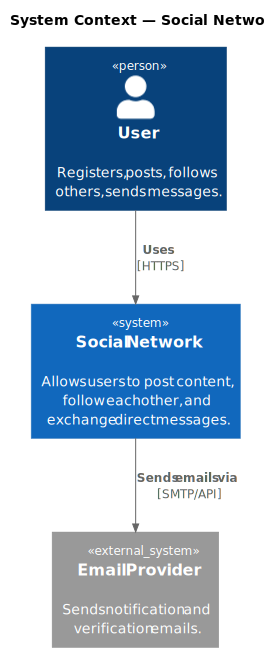

# 1. Introduction and Goals

## 1.1 Requirements Overview

The Social Network is a web-based platform that enables users to:

- Create and manage personal profiles
- Follow other users and be followed back
- Post short-form content and read an aggregated timeline feed
- Send and receive direct messages and mentions

## 1.2 Quality Goals

| Priority | Quality Goal | Scenario |
|----------|-------------|----------|
| 1 | Availability | The platform is accessible 99.9% of the time |
| 2 | Performance | Timeline feed loads in under 500 ms for up to 1 000 followees |
| 3 | Scalability | Handles 10 000 concurrent users without degradation |
| 4 | Security | User data and messages are accessible only to authorised parties |
| 5 | Maintainability | New features can be added within a single bounded context without touching others |

## 1.3 Stakeholders

| Role | Expectations |
|------|-------------|
| End User | Fast, reliable access to social features |
| Product Owner | Rapid feature delivery, clear domain boundaries |
| Developer | Clean architecture, well-defined APIs between bounded contexts |
| Operator | Observable system, straightforward deployment and scaling |

## 1.4 System Context

