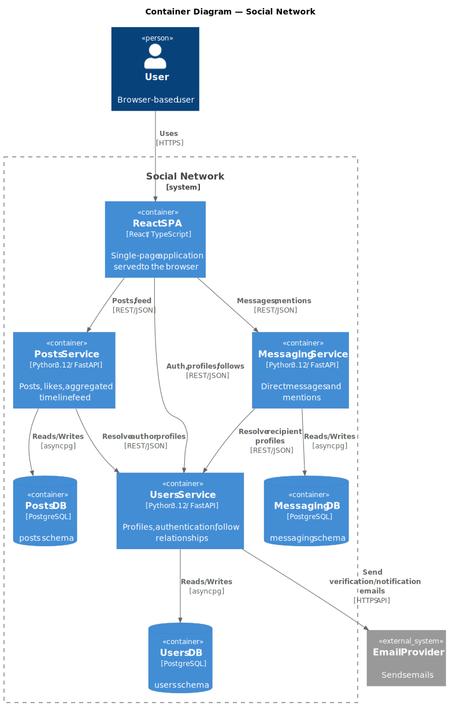

# 5. Building Block View

## 5.1 Level 1 — Containers

| Container | Technology | Responsibility |
|-----------|-----------|----------------|
| React SPA | React / TypeScript | Renders UI, routes user actions to the appropriate service |
| Users Service | Python 3.12 / FastAPI | Authentication (JWT), user profiles, follow graph |
| Posts Service | Python 3.12 / FastAPI | Create/read posts, likes, aggregated timeline feed |
| Messaging Service | Python 3.12 / FastAPI | Direct messages, mentions |
| Users DB | PostgreSQL (`users` schema) | Persistent store for Users Service |
| Posts DB | PostgreSQL (`posts` schema) | Persistent store for Posts Service |
| Messaging DB | PostgreSQL (`messaging` schema) | Persistent store for Messaging Service |

## 5.2 Level 2 — Internal Structure per Service

### Users Service

| Module | Responsibility |
|--------|---------------|
| `auth` | JWT issuance (RS256), login, registration, email verification |
| `profiles` | CRUD for user profiles, avatar handling |
| `follows` | Follow / unfollow, follower/followee lists |

### Posts Service

| Module | Responsibility |
|--------|---------------|
| `posts` | Create, edit, delete posts |
| `feed` | Aggregate timeline from followed users; fan-out on read |
| `likes` | Like / unlike a post |

### Messaging Service

| Module | Responsibility |
|--------|---------------|
| `conversations` | Create and list direct-message conversations |
| `messages` | Send and retrieve messages within a conversation |
| `mentions` | Detect and store @mentions; notify Users Service |

## 5.3 Cross-Context Interfaces

| Caller | Callee | Endpoint | Purpose |
|--------|--------|----------|---------|
| Posts Service | Users Service | `GET /users/{id}` | Enrich post with author profile |
| Messaging Service | Users Service | `GET /users/{id}` | Enrich message with sender/recipient profile |
