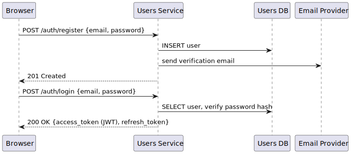
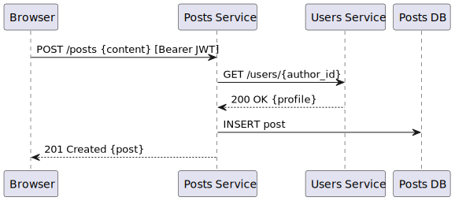
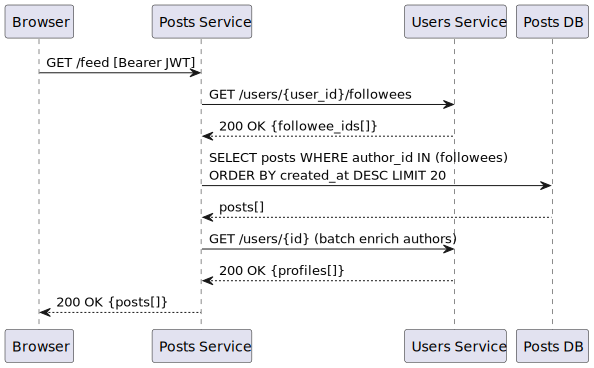

# 6. Runtime View

## 6.1 User Registration and Login



## 6.2 Post Creation



## 6.3 Timeline Feed (Fan-out on Read)



## 6.4 Send Direct Message

```
Browser → Messaging Service: POST /conversations/{id}/messages {text}  [Bearer JWT]
Messaging Service → Users Service: GET /users/{recipient_id}  (verify recipient exists)
Messaging Service → Messaging DB: INSERT message
Messaging Service → Browser: 201 Created {message}
```

## 6.5 Mention Flow

```
Messaging Service: detects @username in message text
Messaging Service → Users Service: GET /users?username={handle}  (resolve mention target)
Messaging Service → Messaging DB: INSERT mention {message_id, target_user_id}
```

## 6.6 JWT Validation (all services)

Each service validates the JWT locally using the public RS256 key — no round-trip to the Users Service is required for token verification. The Users Service is only called when profile data is needed.
